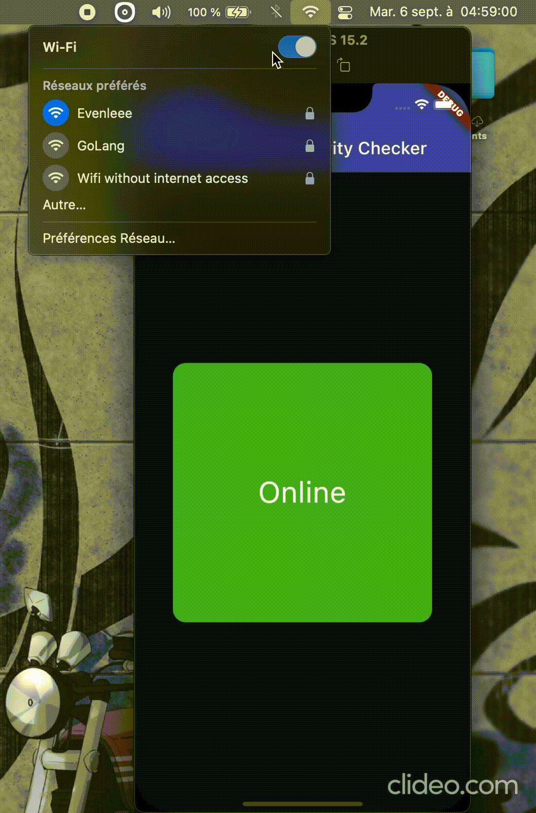

# internet_connectivity_checker

The [connectivity](https://pub.dev/packages/connectivity) package and other similar packages only provides information if there is a network connection, but not if the network is connected to the Internet. That's why the [internet_connectivity_checker](https://github.com/HamadaHiro/internet_connectivity_checker) package helps you easily manage dynamic widgets based on the device's internet access.

<br>



<br>

## Getting started

```bash
flutter pub add internet_connectivity_checker
```

## Usage


Simply import `package:internet_connectivity_checker/internet_connectivity_checker.dart'` and use the `internetConnectivityBuilder`. It takes a builder and an optional parameter, `interval` which is the interval in milliseconds to re-check internet connectivity, default to 5000ms.

<br>

---

<br>

```dart
class Hello extends StatelessWidget {
  const Hello({super.key});

  @override
  Widget build(BuildContext context) {
    return internetConnectivityBuilder(
      (status) {
        bool connected = status == ConnectivityStatus.online;
        return Text(connected ? "Online" : "Offline");
      },
    );
  }
}
```
<br>

A more complete example
```dart
internetConnectivityBuilder(
  interval: 1000,
  (ConnectivityStatus status) {
    if (status == ConnectivityStatus.online) {
      return Container(
        decoration: BoxDecoration(
          color: Colors.green,
          borderRadius: BorderRadius.circular(15),
        ),
        child: Center(child: Text("Connecté", style: kTextStyle)),
      );
    } else if (status == ConnectivityStatus.offine) {
      return Container(
        decoration: BoxDecoration(
          color: Colors.red,
          borderRadius: BorderRadius.circular(15),
        ),
        child: Center(child: Text("Déconnecté", style: kTextStyle)),
      );
    } else { // status == ConnectivityStatus.offline
      return const Center(
        child: SizedBox(
          width: 25,
          height: 25,
          child: CircularProgressIndicator(strokeWidth: 2),
        ),
      );
    }
  },
),
```

<br>

You can also use the `InternetConnectivity().isConnectedToInternet()` stream, provided be the package, to handle the logic yourself.

```dart
class Foo extends StatelessWidget {
  const Foo({super.key});

  @override
  Widget build(BuildContext context) {
    Stream<bool> stream = InternetConnectivity().isConnectedToInternet();
    return StreamBuilder(
      stream: stream,
      builder: (context, snapshot) {
        if (snapshot.hasData && (snapshot.data as bool) == true) {
          return const Text("Online");
        } else if (snapshot.connectionState == ConnectionState.waiting) {
          return const Center(child: CircularProgressIndicator());
        } else {
          return const Text("Offline");
        }
      },
    );
  }
}
```

<br>

You can also customize the domains to check and then, if at least the half of domains lookup succeeded, we pretend internet is on, otherwise, device is offline;
```dart
Stream<bool> stream = InternetConnectivity(
  domainsToCheck: ['google.com', 'example.com', 'github.com', 'pub.dev'],
).isConnectedToInternet(intervalInMilliseconds: 2000);
```

## Additional Information
Contribute to this project by making a pull request or creating a new issue on GitHub.


## License

```
MIT License

Copyright (c) Moustapha Ndoye (@csof3cen), 2022.

Permission is hereby granted, free of charge, to any person obtaining a copy
of this software and associated documentation files (the "Software"), to deal
in the Software without restriction, including without limitation the rights
to use, copy, modify, merge, publish, distribute, sublicense, and/or sell
copies of the Software, and to permit persons to whom the Software is
furnished to do so, subject to the following conditions:

The above copyright notice and this permission notice shall be included in all
copies or substantial portions of the Software.

THE SOFTWARE IS PROVIDED "AS IS", WITHOUT WARRANTY OF ANY KIND, EXPRESS OR
IMPLIED, INCLUDING BUT NOT LIMITED TO THE WARRANTIES OF MERCHANTABILITY,
FITNESS FOR A PARTICULAR PURPOSE AND NONINFRINGEMENT. IN NO EVENT SHALL THE
AUTHORS OR COPYRIGHT HOLDERS BE LIABLE FOR ANY CLAIM, DAMAGES OR OTHER
LIABILITY, WHETHER IN AN ACTION OF CONTRACT, TORT OR OTHERWISE, ARISING FROM,
OUT OF OR IN CONNECTION WITH THE SOFTWARE OR THE USE OR OTHER DEALINGS IN THE
SOFTWARE.
```
